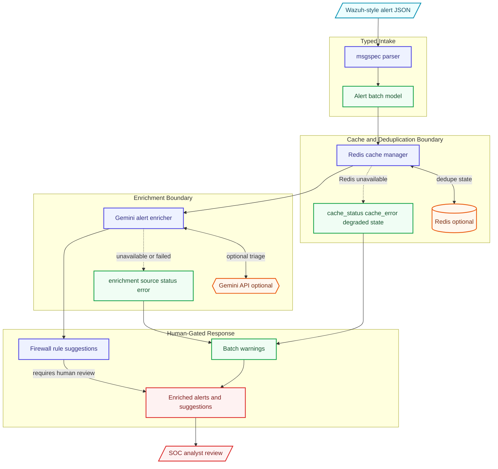

# Architecture

SIEM enrichment pipeline for Wazuh-style alerts with msgspec parsing, Redis duplicate tracking, Gemini-assisted triage, and visible degraded-mode metadata.

This document is written for reviewers who want to understand how the project is shaped before reading the code. It emphasizes boundaries, dependencies, and degraded paths rather than marketing claims.

## Data Flow

1. Alert intake
2. msgspec parser
3. Redis cache/deduplication
4. Gemini enrichment or fallback metadata
5. Firewall suggestion candidates
6. Batch output

## Main Components

- **Parser**: Normalizes inbound alert payloads into typed models.
- **Cache manager**: Tracks duplicate alerts and records Redis degradation state.
- **Enricher**: Adds Gemini or fallback triage metadata without hiding failures.
- **Pipeline**: Propagates warnings to alerts and batches for operator review.

## External Dependencies

- Python 3.10+
- Optional Redis
- Optional Gemini API key
- Representative alert JSON

The project is intentionally explicit about optional services. Mock, fallback, and degraded paths are labeled in result metadata so a demo cannot be mistaken for a successful production integration.

## Failure And Degraded Modes

- External-service failures are captured as warnings, status fields, or source metadata where the domain model supports it.
- Mock/demo behavior is opt-in or explicitly labeled.
- Generated outputs are treated as review candidates, not authoritative decisions.
- CLI output remains user-facing; library internals use logging or structured metadata.

## What To Review In Code

- Redis failures surface through cache_status/cache_error metadata.
- Firewall rules are suggestions requiring human review.
- Batch warnings show operational degradation instead of silent success.

## Current Limits

- Firewall suggestions should not be applied automatically.
- Alert triage depends on source data quality.
- Redis/Gemini outages degrade behavior but are made visible.
